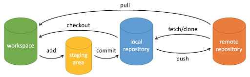

### Git工作原理
#### 什么是git
git是一个分布式的版本控制器，没有中央服务器，可以离线提交
#### 工作原理
Git 的工作就是创建和保存你项目的快照及与之后的快照进行对比

+ workspace：工作区
+ staging area：暂存区/缓存区
+ local repository：版本库或本地仓库
+ remote repository：远程仓库

#### 分布式版本控制系统

Git是一种分布式版本控制系统，每个开发者的本地电脑上都有完整的代码仓库副本。这样的设计使得即使在没有网络连接的情况下也可以进行工作和版本控制管理。
#### 基本概念

+ 仓库（Repository）：存储项目文件及其历史记录的地方。
+ 提交（Commit）：将文件的当前状态记录为一个节点，可以理解为一个快照。
+ 分支（Branch）：用来开发新功能或者修复Bug，独立于主线的开发线。
+ 合并（Merge）：将不同分支的修改合并到一起。
+ 远程仓库（Remote Repository）：托管在网络上的Git仓库，如GitHub、GitLab等。
### Git的基本操作
##### 初始化一个新仓库

```bash

git init
```
##### 添加与提交文件

```bash

git add <filename>
git commit -m "commit message"
```

##### 查看状态与历史记录

```bash

git status
git log
```
##### 分支操作

创建分支：

```bash

git branch <branchname>
```
切换分支：

```bash

git checkout <branchname>
```

合并分支：

```bash

git merge <branchname>
```

##### 远程操作
克隆远程仓库：

```bash

git clone <remote_repo_url>
```
添加远程仓库：

```bash

git remote add origin <remote_repo_url>
```
推送到远程仓库：

```bash

git push origin <branchname>
```
##### 拉取远程仓库更新：
```
bash

git pull origin <branchname>
```
### Git的高级操作
##### 撤销与回退

撤销工作目录中对文件的修改：

```bash

git checkout -- <filename>
```
回退到历史版本：

```bash

git reset --hard <commit_hash>
```
##### 子模块（Submodule）

Git允许在一个仓库中引用另一个仓库，这称为子模块。

```bash

git submodule add <submodule_repo_url>
```
### Git分支管理
##### 分支管理基础

Git中的分支是指一个独立的工作路径，可以在其中进行开发，而不影响主开发线（通常是master分支）。分支的使用可以帮助团队并行开发不同功能或修复Bug，最终再将各个分支的更改合并到主分支。
##### 创建分支

创建一个新分支

```bash

git branch <branchname>
```
##### 切换分支

切换到一个已存在的分支

```bash

git checkout <branchname>
```
或者使用Git 2.23版本后推荐的方式：

```bash

git switch <branchname>
```
##### 查看分支

可以查看所有分支及其当前所在分支的状态：

```bash

git branch
```
##### 删除分支

删除一个已经合并到主分支的分支：

```bash

git branch -d <branchname>
```
##### 合并分支
使用 git merge

git merge用于将一个分支的更改合并到当前分支。合并操作通常在开发完成后，将一个功能分支合并到主分支（如master）时使用。

例如，切换到主分支（master），然后合并一个功能分支（feature-branch）：

```bash

git checkout master
git merge feature-branch
```
使用 git rebase

git rebase也是合并分支的一种方式，但它会将当前分支的提交“移动”到目标分支的最新提交之后，形成一个线性的提交历史。

例如，假设在开发中，先切换到功能分支（feature-branch），然后使用git rebase将其基于主分支（master）的最新提交：

```bash

git checkout feature-branch
git rebase master
```
##### 解决合并冲突

合并分支或者使用git rebase时，如果Git无法自动合并更改，就会发生冲突。冲突的文件将会标记出来，需要手动解决冲突后再进行提交。