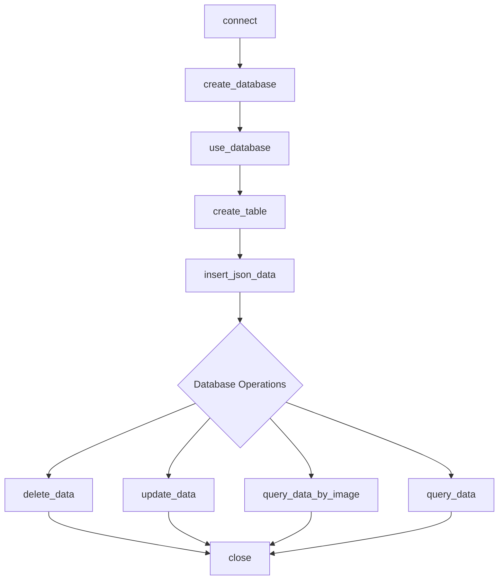
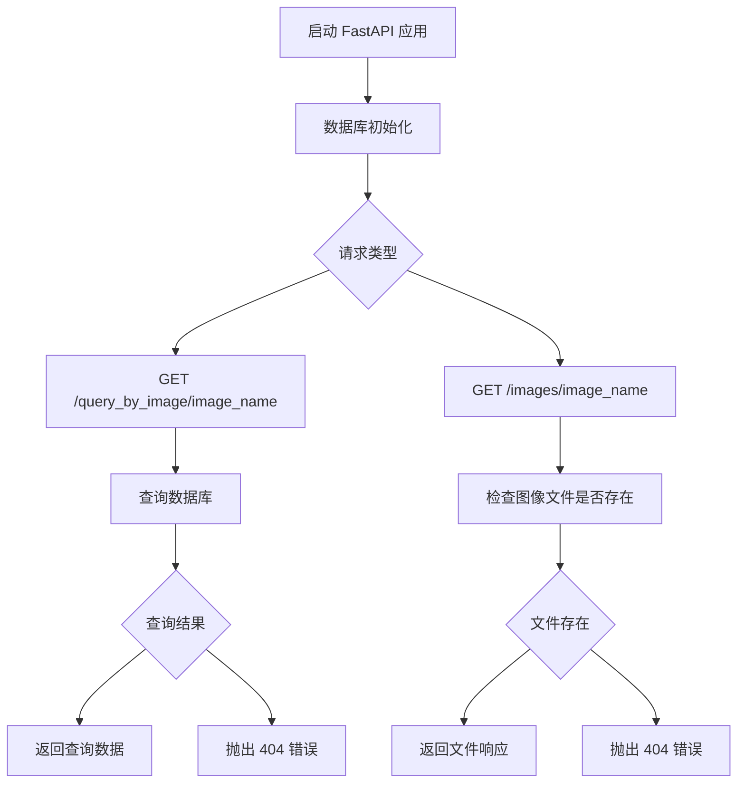

## 自动驾驶数据加工与清洗
### 整体流程


+ **步骤1（数据下载、初始化数据库、启动服务器）**

`python serverInit.py` 

如下
```Connection successful
Database 'trainingDB' created or already exists
Using database 'trainingDB'
Starting download and extraction...
single-vehicle-side-example_16206132983635968.zip: 100%|█████████████████████████████████████████████████████████████████████████████████████████████████████████████████| 203M/203M [00:19<00:00, 11.2MB/s]
解压缩: 100%|████████████████████████████████████████████████████████████████████████████████████████████████████████████████████████████████████████████████████████████| 433/433 [00:01<00:00, 318.88it/s]
文件已下载并解压至 /home/hyq/work/2024_training/作业1/download
Download and extraction completed.
Connection successful
Database 'trainingDB' created or already exists
Using database 'trainingDB'
Table created successfully
calib/camera_intrinsic/000000.json 200
Data inserted successfully
calib/camera_intrinsic/000001.json 200
Data inserted successfully
calib/camera_intrinsic/000002.json 200
Data inserted successfully
...
Starting FastAPI server...
INFO:     Started server process [10186]
INFO:     Waiting for application startup.
INFO:     Application startup complete.
INFO:     Uvicorn running on http://0.0.0.0:8000 (Press CTRL+C to quit)
```
+ **步骤2（启动客户端）**

`python client.py`

如下（输入image名称进行查询或输入exit退出）
```
Enter image name (or 'exit' to quit): 000001.jpg
{
    "calib_lidar_to_camera_json": {
        "rotation": [
            [
                0.006283,
                -0.999979,
                -0.001899
            ],
            [
                -0.005334,
                0.001865,
                -0.999984
            ],
            [
                0.999966,
                0.006293,
                -0.005322
            ]
        ],
        "translation": [
            [
                -0.298036
            ],
            [
                -0.666812
            ],
            [
                -0.516927
            ]
        ]
    },
    "label_camera_std_json": [
        {
            "type": "Car",
            "alpha": 0.19320927745804112,
            "2d_box": {
                "xmax": 457.211487,
                "xmin": 0,
                "ymax": 661.1854860000001,
                "ymin": 404.296692
            },
            "rotation": -1.570282,
            "3d_location": {
                "x": 32.80635,
                "y": 6.04457,
                "z": -0.8653639
            },
            "3d_dimensions": {
                "h": 2.017057,
                "l": 3.916855,
                "w": 2.197865
            },
            "occluded_state": 2,
            "truncated_state": 0
        }
    ],
    "label_lidar_std_json": [
        {
            "type": "Car",
            "alpha": 0.18958860213516604,
            "2d_box": {
                "xmax": 457.211487,
                "xmin": 0,
                "ymax": 661.1854860000001,
                "ymin": 404.296692
            },
            "rotation": -1.556342,
            "3d_location": {
                "x": 32.74374,
                "y": 6.378814,
                "z": -0.9854571
            },
            "3d_dimensions": {
                "h": 2.031636,
                "l": 4.218545,
                "w": 2.11253
            },
            "occluded_state": 2,
            "truncated_state": 0
        }
    ],
    "image_path": "image/000001.jpg",
    "image_http_address": "http://localhost:8000/images/000001.jpg"
}
```
可复制image_http_address中的链接下载该图片
### 数据库设计
**表名：data_info**

该表用于存储与图像、点云数据及其相关校准和标签数据的信息。

**表结构**

列名|数据类型|约束条件|描述
-|-|-|-
id|	INT|	PRIMARY KEY, AUTO_INCREMENT|	自动增长的主键，用于唯一标识每条记录
image_path|	VARCHAR(255)|	NOT NULL|	图像文件的路径
image_timestamp|	VARCHAR(255)|	NOT NULL|	图像的时间戳
pointcloud_path|	VARCHAR(255)|	NOT NULL|	点云文件的路径
point_cloud_stamp|	VARCHAR(255)|	NOT NULL|	点云的时间戳
calib_camera_intrinsic_path|	VARCHAR(255)|	NOT NULL|	相机内参文件的路径
calib_lidar_to_camera_path|	VARCHAR(255)|	NOT NULL|	激光雷达到相机的校准文件路径
label_camera_std_path|	VARCHAR(255)|	NOT NULL|	相机标准标签文件的路径
label_lidar_std_path|	VARCHAR(255)|	NOT NULL|	激光雷达标准标签文件的路径
calib_camera_intrinsic_json|	JSON|	NULL|	相机内参文件的JSON内容
calib_lidar_to_camera_json|	JSON|	NULL|	激光雷达到相机的校准文件的JSON内容
label_camera_std_json|	JSON|	NULL|	相机标准标签文件的JSON内容
label_lidar_std_json|	JSON|	NULL|	激光雷达标准标签文件的JSON内容
image_size|	BIGINT|	NULL|	图像文件的大小（以字节为单位）
pointcloud_size|	BIGINT|	NULL|	点云文件的大小（以字节为单位）


    主键：id 列是主键，自动增长，用于唯一标识每条记录。
    非空约束：image_path、image_timestamp、pointcloud_path、point_cloud_stamp、calib_camera_intrinsic_path、calib_lidar_to_camera_path、label_camera_std_path、label_lidar_std_path 列为非空。
    JSON 列：calib_camera_intrinsic_json、calib_lidar_to_camera_json、label_camera_std_json、label_lidar_std_json 列存储相应文件的内容，以JSON格式存储。
    大小列：image_size 和 pointcloud_size 列存储图像和点云文件的大小（以字节为单位）。

### 代码设计

#### 文件：db_connection.py
##### 目的

定义了一个 MySQLDatabase 类，用于与 MySQL 数据库进行连接、操作、管理数据表及其记录。
类和方法
##### 类：MySQLDatabase

用于管理与 MySQL 数据库的连接和操作，包括连接数据库、创建数据库、创建表、插入数据、更新数据、查询数据和删除数据。
###### 初始化方法

```python

def __init__(self, user, password, host, database, port=3208):
    # 初始化数据库连接参数

    参数：
        user：数据库用户名
        password：数据库密码
        host：数据库主机地址
        database：数据库名称
        port：数据库端口，默认为 3208
```


###### 方法：connect

```python

def connect(self):
    '''数据库连接'''

    功能：建立与 MySQL 数据库的连接，并初始化游标。
    异常处理：处理连接错误，包括访问被拒绝、数据库不存在、连接错误和服务器丢失等情况。
```

###### 方法：close

```python

def close(self):
    '''关闭数据库连接'''

    功能：关闭数据库连接和游标。
```
###### 方法：create_database

```python

def create_database(self):
    '''创建数据库'''

    功能：创建数据库，如果数据库不存在。
    异常处理：处理数据库创建失败的情况。
```
###### 方法：use_database

```python

def use_database(self):
    '''使用数据库'''

    功能：选择使用指定的数据库。
    异常处理：处理数据库不存在的情况。
```
###### 方法：create_table

```python

def create_table(self):
    '''创建数据表'''

    功能：创建数据表 data_info，如果表不存在。
    异常处理：处理表创建失败的情况。
```
###### 方法：insert_json_data

```python

def insert_json_data(self, data):
    '''读取json插入数据'''

    功能：从 JSON 文件中读取数据，并插入到 data_info 表中。
    异常处理：处理数据插入失败的情况。
```
###### 方法：read_json_file

```python

def read_json_file(self, file_path):
    '''读取json'''

    功能：读取 JSON 文件并返回其内容。
```
###### 方法：get_file_size

```python

def get_file_size(self, file_path):
    '''获取文件大小'''

    功能：获取指定文件的大小。
```
方法：update_data

```python

def update_data(self, record_id, data):
    '''更新数据'''

    功能：更新指定记录 ID 的数据。
    异常处理：处理数据更新失败的情况。
```
###### 方法：query_data_by_image

```python

def query_data_by_image(self, image_name):
    '''根据图片名查询'''

    功能：根据图像文件名查询相关数据。
    异常处理：处理查询失败的情况。
```
###### 方法：query_data

```python

def query_data(self, query):
    '''查询数据'''

    功能：执行给定的 SQL 查询并返回结果。
    异常处理：处理查询失败的情况。
```
###### 方法：delete_data

```python

def delete_data(self, record_id):
    '''删除数据'''

    功能：删除指定记录 ID 的数据。
    异常处理：处理数据删除失败的情况。
```
##### 代码结构
```plaintext
MySQLDatabase
├── __init__(self, user, password, host, database, port=3208)
├── connect(self)
├── close(self)
├── create_database(self)
├── use_database(self)
├── create_table(self)
├── insert_json_data(self, data)
├── read_json_file(self, file_path)
├── get_file_size(self, file_path)
├── update_data(self, record_id, data)
├── query_data_by_image(self, image_name)
├── query_data(self, query)
└── delete_data(self, record_id)
```

#### 文件：download_extract.py
##### 目的
定义了下载和解压缩文件的功能，使用 requests 库从指定的 URL 下载 ZIP 文件，并将其解压缩到指定的目录。
##### 函数和方法
###### 函数：get_filename_from_url

```python

def get_filename_from_url(url):

    功能：从给定的 URL 中提取文件名，并处理 URL 编码。
    参数：
        url：要下载的文件的 URL。
    返回：从 URL 中解析出的文件名，确保文件名的有效性。
    
```
###### 函数：download_and_extract_zip
``` python
def download_and_extract_zip(url, extract_to='.'):

    功能：下载并解压缩 ZIP 文件。
    参数：
    url：要下载的 ZIP 文件的 URL。
    extract_to：解压缩文件的目标目录，默认当前目录 ('.')。
    
    
```
##### 代码结构

```plaintext

download_extract.py
├── get_filename_from_url(url)
└── download_and_extract_zip(url, extract_to='.')
```

#### 文件：httpserver.py
##### 目的
定义了一个使用 FastAPI 框架构建的 HTTP API 服务，提供了基于图像名称查询相关数据和获取图像文件的接口。
#### 函数和方法
###### 函数：query_by_image

```python

@app.get("/query_by_image/{image_name}")
def query_by_image(image_name: str):

    功能：根据图像名称查询相关数据。
    参数：
        image_name：图像文件名。
    返回：相关数据，包括构建的图像本地 HTTP 地址。
    异常处理：如果图像未找到，抛出 404 错误。
```

###### 函数：get_image

```python

@app.get("/images/{image_name}")
def get_image(image_name: str):

    功能：根据图像名称获取图像文件。
    参数：
        image_name：图像文件名。
    返回：图像文件的响应。
    异常处理：如果图像文件未找到，抛出 404 错误。
```
###### 函数：start_server

```python

def start_server():

    功能：启动 FastAPI 服务器。
    参数：无。
```
##### 代码结构

```plaintext

httpserver.py
├── FastAPI 应用实例
│   ├── app = FastAPI()
├── 数据库初始化
│   ├── db = MySQLDatabase(user='root', password='123456', host='127.0.0.1', database='trainingDB', port=3208)
│   ├── db.connect()
│   ├── db.create_database()
│   ├── db.use_database()
├── 路由
│   ├── /query_by_image/{image_name}
│   │   ├── def query_by_image(image_name: str)
│   ├── /images/{image_name}
│   │   ├── def get_image(image_name: str)
├── 函数
│   ├── start_server()
```

